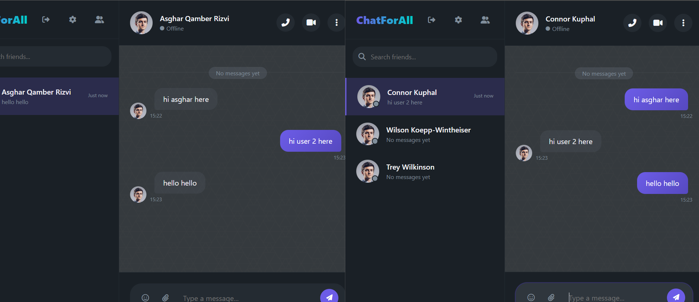
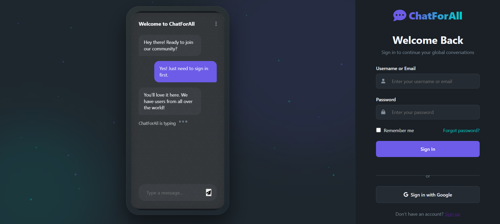
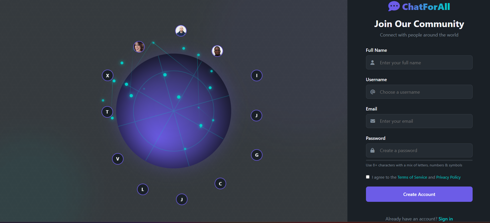
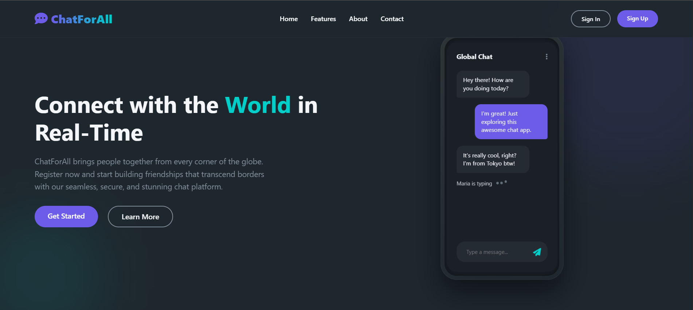
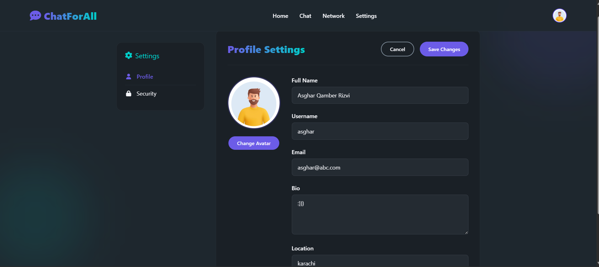

# Real-Time Chat Application "CHAT FOR ALL " 🚀

A high-performance, real-time chat application built with Node.js, Express, MongoDB, Socket.IO, Docker, and Nginx. This application supports thousands of concurrent users with features like friend management, online status, and message history.

## ✨ Features

- **User Authentication**: Secure signup and login
- **Friend System**: Add friends and manage requests
- **Real-Time Chat**: Instant messaging with Socket.IO
- **Status Indicators**: See who's online/offline
- **Message History**: All conversations are saved
- **Scalable Architecture**: Load balanced with Nginx
- **Dockerized**: Easy deployment with containers

## 📸 Screenshots

| Sign In | Sign Up |
|---------|---------|
|  |  |

| Homepage | Chat Interface |
|----------|----------------|
|  |  |

| Friend Management | Profile Settings |
|-------------------|------------------|
|  |  |

## 🛠️ Technologies Used

- **Frontend**: HTML5, CSS3, JavaScript
- **Backend**: Node.js, Express
- **Database**: MongoDB
- **Real-Time**: Socket.IO
- **Deployment**: Docker, Nginx (load balancing)
- **Other**: Bcrypt (password hashing), JWT (authentication)

## Prerequisites
- Docker and Docker Compose installed
- Node.js (for development)

## 📈 Performance
- Handles 10,000+ concurrent users
- Response time under 200ms at peak load
- Auto-scaling with Nginx load balancing and Docker
